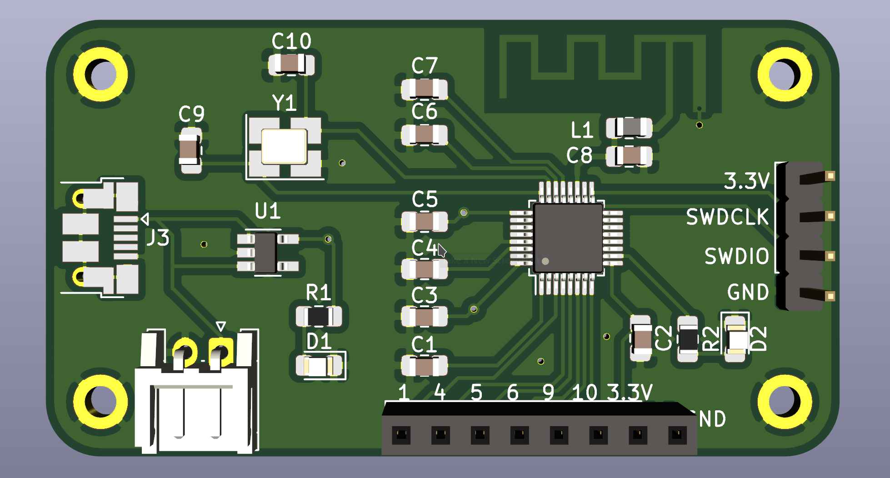

# nRF52811 PCB

This is the schematics and footprint of a basic board with the [nRF52811 microcontroller](https://www.nordicsemi.com/?sc_itemid=%7B7CBDF55C-9745-4A7D-A491-5B66AE9454B6%7D
) from [Nordic Semiconductor](https://devzone.nordicsemi.com). This microcontroller supports Bluetooth Low Energy 5.1. The board contains one LED and can be powered either over Micro-USB or a Li-Po battery. It requires a SWD-capable programmer for programming and debugging.

The board was primarily designed for testing and familiarizing myself with [KiCad 5.1](http://www.kicad.org).

## Design

## License
 This work is licensed under a <a rel="license" href="http://creativecommons.org/licenses/by/4.0/">Creative Commons Attribution 4.0 International License</a>.
